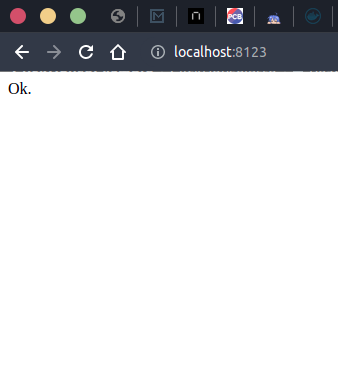
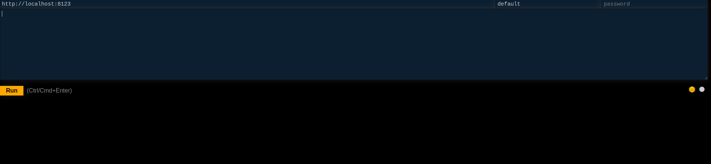

# ClickHouseIntro
Примеры взаимодействия с ClickHouse.

## Запуск ClickHouse
Для запуска необходимо прописать команду, если ClickHouse еще не запущен.
```shell
docker-compose up -d
```

## Веб клиент ClickHouse
Для того чтобы убедиться, что ClickHouse запущен необходимо открыть браузер
и прописать в адресной строке следующий uri http://localhost:8123/ \
В результате должно появиться следующее окно



Так же можно открыть страницу с возможностью вводи sql команд, и вывода результатов.
Для этого необходимо ввести следующий url: http://localhost:8123/play/
В результате должно появиться такое окно: 


В этом окне можно вводить различные команды и наблюдать за тем, что будет выведено в итоге.

Для примера можно отправить sql запрос
```sql
SHOW DATABASES
```
или 
```sql
SELECT name FROM system.databases
```
В результате будет выведен список названий существующих баз данных в ClickHouse.

Или такой запрос 
```sql
CREATE DATABASE IF NOT EXISTS Test;
```
В результате будет создана база данных Test.

## Другие способы взаимодействия
Можно sql запросы в теле запросов к ClickHouse. 
В данном случае запрос отправлен из терминала с использованием утилиты curl.

```shell
echo 'SELECT version()' | curl 'http://localhost:8123/' --data-binary @-
```
В результате выводится версия ClickHouse.

Вот еще парочка запросов:
```shell
echo 'CREATE DATABASE IF NOT EXISTS Test2' | curl 'http://localhost:8123/' --data-binary @-
```
```shell
cat ./ShowDB.sql | curl 'http://localhost:8123/' --data-binary @-
```
